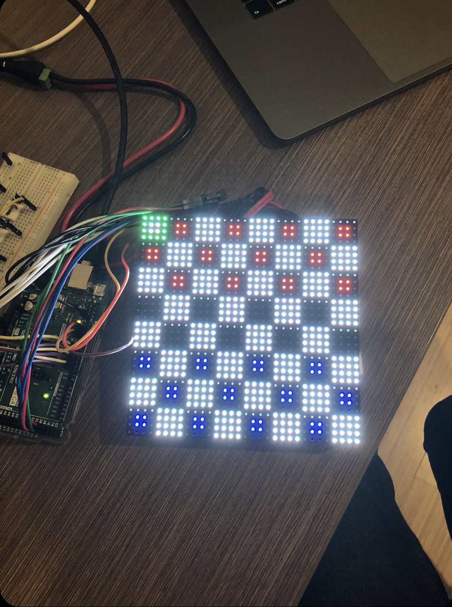
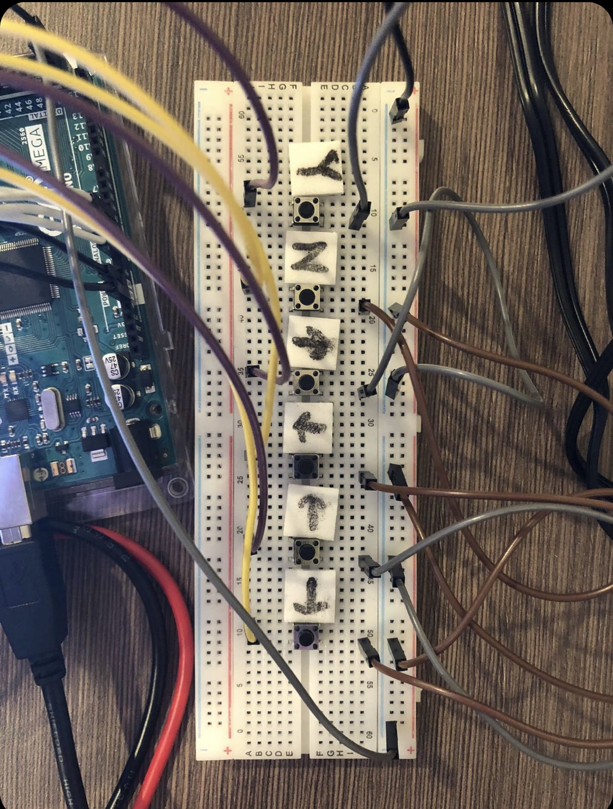
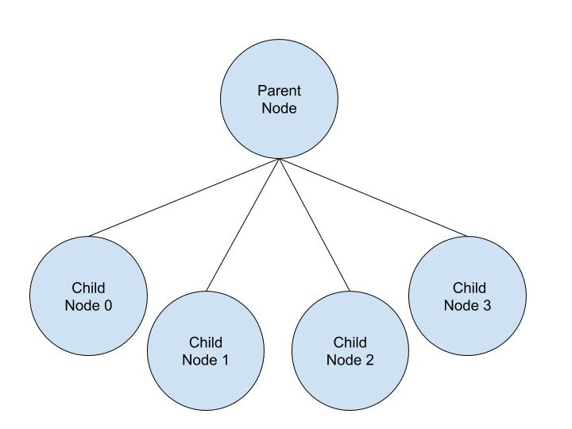
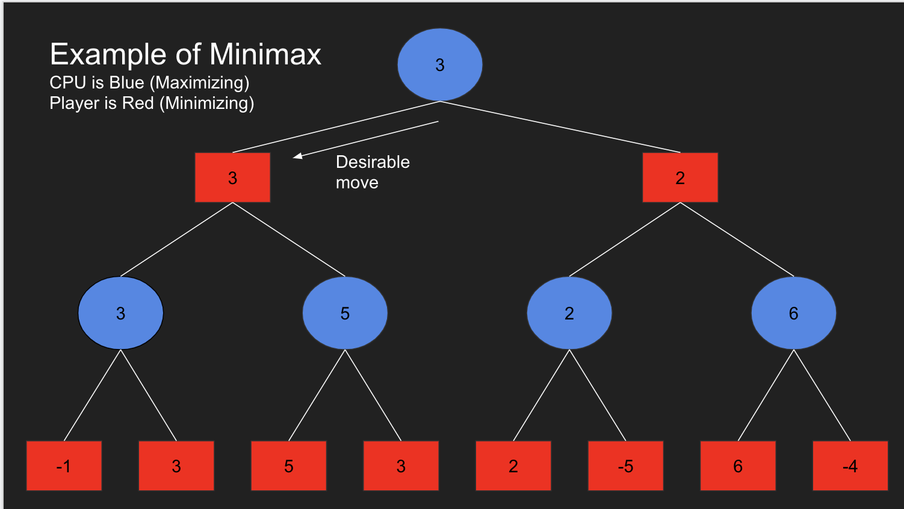
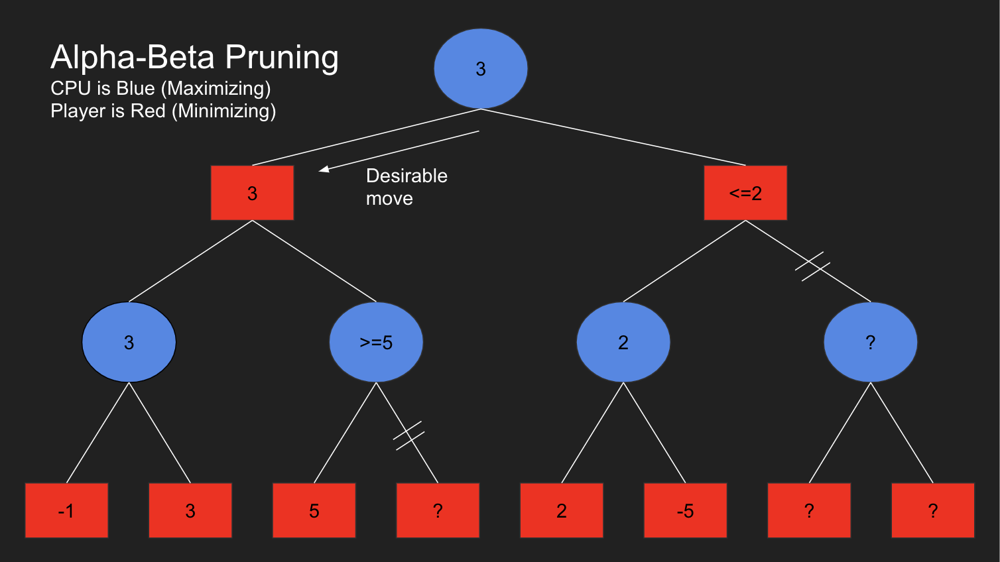

# Minimax-Checkers-with-Alpha-Beta-Pruning-
Andrew Wang, Connor Byers, Nick Faria, Nick Makharinets

Welcome to minimax checkers! For this project, we created a digital checkers board using a 32x32 LED matrix and an Arduino Mega. We first developed a player vs player gamemode by creating the basic checkers board environment on the LED matrix. Then, for the player vs computer gamemode, we developed a minimax algorithm with alpha-beta pruning in order to generate the CPU’s moves in C++. Communication between an auxiliary device, such as a laptop, and the Arduino Mega is mandatory since the Mega does not have enough memory to run the minimax algorithm.

When playing on player vs computer mode, the arduino works in conjunction with the minimax algorithm written in C++ on the laptop. The choice of C++ was in part due to the previously existing C++ rule and movement code and its object oriented nature over C.  All the player interactions are still processed in the same way on the mega, after which the computer is given a signal to compute its optimal move using a Minimax algorithm with alpha beta pruning. This process is repeated every turn, appending the current gamestate as required. 

The software on the laptop can be divided into three key components:
  - Minimax Algorithm, which recursively chooses the best possible move
  - Move projection, which projects all possible board states to be analysed 
  - Evaluation, computes the desirability of a given board relative to the player
I'll only go over the minimax algorithm in this readme file, but more on that later.

Below is the led board. We can see the checkers board represented by white and black tiles, the checkers pieces in blue and red, and a green cursor in the top left corner.

To control the pieces, we built our own controller using pushbuttons and a breadboard and hooked it up to the mega. here is a detailed view of it.

The arrows move the green cursor in the appropriate direction. The 'Y' button selects a tile and allows the user to perform an attack afterwards. The 'N' button allows the user to cancel a tile selection.

For our player vs CPU component, we used the minimax algorithm, with alpha-beta pruning, to generate the moves. To implement our minimax algorithm, we created a class called Node whose instances would represent every “node” of the decision tree. The most important attribute in the class was the vector of type node called “children,” which stores the child nodes.

Disclaimer: I made these diagrams myself to avoid citation issues, mind the simplicity.

The minimax algorithm is simple to understand. First, we designated one player, the computer, as the “maximizing player” and the other, the user, as the “minimizing player.” This means that after the evaluation function is called on a board state, the maximizing player will favour boards with a higher (positive) value whereas the minimizing player will favour those with a lower (negative) value. To project the next move for the computer, we took the current board state as a parameter. From this board state, we alternated between projecting all the possible board states after the computer or the player makes a move. This was accomplished by scanning through the board for the player or the computer’s pieces. If the pieces could move, we created a new board state and stored it in a vector. Once we reached a certain predetermined “depth” (how many moves we chose to look ahead) we called the evaluate function on the final board states. From here, we performed a series of maximizing and minimizing on the evaluations, alternating as we go up the decision tree, until we received a final value. 

The minimax algorithm, by nature, is computationally expensive as it runs in O(b^d) where b is the number of legal moves at each point of the tree and d is the maximum depth of the tree. Minimax, by itself, could sometimes take several seconds, or minutes, to generate a move for the computer. To help alleviate this, we implemented alpha-beta pruning, which is an improved version of the minimax algorithm that does not search through redundant branches of the decision tree. Essentially, whenever the maximum score the minimizing player is guaranteed of becomes less than the minimum score of the maximizing player, the maximizing player no longer needs to search through the node’s children (and vice-versa.) In the best-case scenario, alpha-beta pruning runs at O(b^(d/2)) if the moves are ordered in a way that makes pruning, the removal of redundant branches, more likely. 

